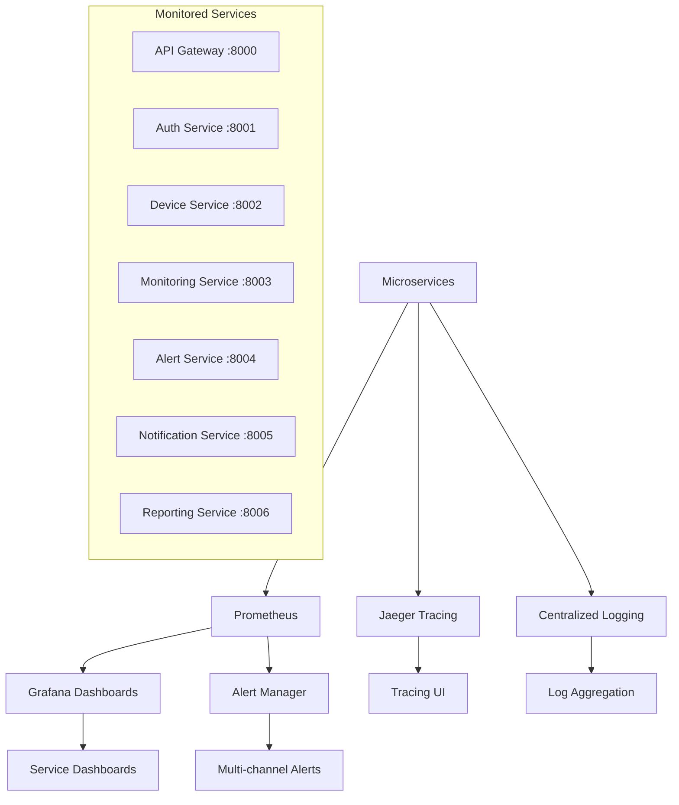

# NetPulse Monitoring & Alerting Setup

This document describes the comprehensive monitoring and alerting system for NetPulse's microservices architecture.

## Overview

NetPulse includes a complete monitoring stack designed for microservices observability:

- **Prometheus**: Metrics collection and alerting from all microservices
- **Grafana**: Visualization dashboards with service-specific views
- **AlertManager**: Alert routing and notifications
- **Jaeger**: Distributed tracing across microservices
- **Node Exporter**: System-level metrics
- **Flower**: Celery task monitoring for background jobs

## Microservices Monitoring Architecture



## Quick Start

### 1. Start the Full Monitoring Stack

```bash
# Build and start all services including monitoring
docker-compose -f docker-compose.prod.yml up --build -d

# Verify all microservices and monitoring are running
docker-compose -f docker-compose.prod.yml ps

# Check service health
curl http://localhost:8000/health  # API Gateway
curl http://localhost:8001/health  # Auth Service
curl http://localhost:8002/health  # Device Service
curl http://localhost:8003/health  # Monitoring Service
```

### 2. Access the Monitoring Interfaces

| Service | URL | Purpose | Credentials |
|---------|-----|---------|-------------|
| **Grafana** | http://localhost:3001 | Service dashboards & alerts | admin/admin |
| **Prometheus** | http://localhost:9090 | Metrics & targets | - |
| **AlertManager** | http://localhost:9093 | Alert management | - |
| **Jaeger** | http://localhost:16686 | Distributed tracing | - |
| **Flower** | http://localhost:5555 | Celery monitoring | - |
| **Node Exporter** | http://localhost:9100/metrics | System metrics | - |

### 3. Microservice Health Checks

Each microservice exposes health endpoints:

```bash
# Check all service health
for port in 8000 8001 8002 8003 8004 8005 8006; do
    echo "Checking service on port $port:"
    curl -s http://localhost:$port/health | jq '.status'
done
```

```

### 4. Configure Service-Specific Alerting

Edit `monitoring/alertmanager.yml` to configure your notification channels for microservices:

```yaml
# Microservices-aware alert routing
route:
  group_by: ['alertname', 'service', 'severity']
  group_wait: 10s
  group_interval: 10s
  repeat_interval: 1h
  receiver: 'default'
  routes:
  - match:
      severity: critical
      service: auth-service
    receiver: 'auth-critical'
  - match:
      severity: critical
      service: monitoring-service
    receiver: 'monitoring-critical'

receivers:
- name: 'default'
  slack_configs:
  - api_url: 'YOUR_SLACK_WEBHOOK_URL'
    channel: '#netpulse-alerts'
    title: 'NetPulse Alert - {{ .GroupLabels.service }}'

- name: 'auth-critical'
  email_configs:
  - to: 'security-team@yourcompany.com'
    subject: 'CRITICAL: NetPulse Auth Service Alert'
    smarthost: 'smtp.yourcompany.com:587'
```

## Microservices Dashboards

### 1. NetPulse Overview Dashboard
- **URL**: http://localhost:3001/d/netpulse-overview/netpulse-microservices-overview
- **Description**: High-level view of all microservices health and performance
- **Key Panels**:
  - Service status matrix (all 7 microservices)
  - Request rate across all services
  - Error rate trends by service
  - Response time percentiles
  - Database connection health
  - Message queue status

### 2. Service-Specific Dashboards

Each microservice has its dedicated monitoring dashboard:

| **Service** | **URL** | **Key Metrics** |
|-------------|---------|-----------------|
| **API Gateway** | `/d/api-gateway/api-gateway-dashboard` | Request routing, auth rates, rate limiting |
| **Auth Service** | `/d/auth-service/auth-service-dashboard` | Login trends, JWT validation, security events |
| **Device Service** | `/d/device-service/device-service-dashboard` | Device CRUD operations, inventory status |
| **Monitoring Service** | `/d/monitoring-service/monitoring-service-dashboard` | Real-time pipeline, queue health, WebSocket connections |
| **Alert Service** | `/d/alert-service/alert-service-dashboard` | Alert generation, acknowledgments, resolution times |
| **Notification Service** | `/d/notification-service/notification-service-dashboard` | Delivery success rates, channel performance |
| **Reporting Service** | `/d/reporting-service/reporting-service-dashboard` | Report generation, export performance |

## Service Monitoring

### Health Check Endpoints

Each microservice provides standardized health endpoints:

```bash
# Check all service health
services=("8000" "8001" "8002" "8003" "8004" "8005" "8006")
for port in "${services[@]}"; do
    echo "Checking service on port $port:"
    curl -s --max-time 5 http://localhost:$port/health | jq '.status' || echo "Failed"
done

# Check readiness for load balancer
curl http://localhost:8000/ready

# Check liveness for container orchestration  
curl http://localhost:8000/alive
```

### Prometheus Metrics per Service

**API Gateway Metrics:**
```promql
# Request rate by service route
rate(http_requests_total{service="api-gateway"}[5m])

# Authentication success rate
rate(auth_requests_total{status="success"}[5m]) / rate(auth_requests_total[5m])

# Rate limiting effectiveness
rate(rate_limit_exceeded_total[5m])
```

**Device Service Metrics:**
```promql
# Device operation performance
histogram_quantile(0.95, rate(device_operation_duration_seconds_bucket[5m]))

# Device status distribution
count by (status) (device_status_total)

# Database connection health
postgresql_connections_active / postgresql_connections_max
```

**Monitoring Service Metrics:**
```promql
# Metric processing rate
rate(metrics_processed_total[5m])

# Background job queue health
celery_queue_length{queue="monitoring"}

# WebSocket connection count
websocket_connections_active
```

## Alert Rules for Microservices

### Service Availability Alerts

```yaml
# monitoring/alert_rules.yml
groups:
- name: microservices_availability
  rules:
  - alert: MicroserviceDown
    expr: up{job=~"api-gateway|auth-service|device-service|monitoring-service|alert-service|notification-service|reporting-service"} == 0
    for: 1m
    labels:
      severity: critical
      service: "{{ $labels.job }}"
    annotations:
      summary: "Microservice {{ $labels.job }} is down"
      description: "{{ $labels.job }} has been down for more than 1 minute"

  - alert: HighServiceErrorRate
    expr: rate(http_requests_total{status=~"5.."}[5m]) / rate(http_requests_total[5m]) > 0.05
    for: 5m
    labels:
      severity: warning
      service: "{{ $labels.job }}"
    annotations:
      summary: "High error rate on {{ $labels.job }}"
      description: "{{ $labels.job }} has error rate of {{ $value | humanizePercentage }}"

  - alert: ServiceHighResponseTime
    expr: histogram_quantile(0.95, rate(http_request_duration_seconds_bucket[5m])) > 1
    for: 10m
    labels:
      severity: warning
      service: "{{ $labels.job }}"
    annotations:
      summary: "High response time on {{ $labels.job }}"
      description: "95th percentile response time is {{ $value }}s"
```

### Authentication Service Alerts

```yaml
- name: auth_service_alerts
  rules:
  - alert: HighFailedLoginRate
    expr: rate(auth_login_attempts_total{status="failed"}[5m]) > 10
    for: 5m
    labels:
      severity: warning
      service: auth-service
    annotations:
      summary: "High rate of failed login attempts"
      description: "{{ $value }} failed login attempts per second"

  - alert: JWTValidationFailure
    expr: rate(auth_jwt_validations_total{status="failed"}[5m]) > 5
    for: 5m
    labels:
      severity: critical
      service: auth-service
    annotations:
      summary: "High JWT validation failure rate"
      description: "{{ $value }} JWT validation failures per second"
```

### Background Job Alerts

```yaml
- name: background_jobs
  rules:
  - alert: CeleryQueueBacklog
    expr: celery_queue_length > 1000
    for: 5m
    labels:
      severity: warning
      component: celery
    annotations:
      summary: "Celery queue backlog detected"
      description: "Queue {{ $labels.queue }} has {{ $value }} pending tasks"

  - alert: MonitoringJobFailures
    expr: rate(celery_task_failed_total{queue="monitoring"}[5m]) > 1
    for: 5m
    labels:
      severity: critical
      service: monitoring-service
    annotations:
      summary: "High rate of monitoring job failures"
      description: "{{ $value }} monitoring tasks failing per second"
```

## Performance Monitoring

### Service Performance Targets

| **Service** | **Response Time (P95)** | **Throughput** | **Error Rate** |
|-------------|------------------------|----------------|----------------|
| **API Gateway** | < 50ms | 1000 RPS | < 0.1% |
| **Auth Service** | < 100ms | 200 RPS | < 0.5% |
| **Device Service** | < 100ms | 500 RPS | < 0.1% |
| **Monitoring Service** | < 200ms | 2000 RPS | < 1% |
| **Alert Service** | < 500ms | 100 RPS | < 0.5% |
| **Notification Service** | < 1s | 50 RPS | < 2% |
| **Reporting Service** | < 2s | 10 RPS | < 1% |

### Load Testing

```bash
# Install hey for load testing
go install github.com/rakyll/hey@latest

# Test API Gateway performance
hey -n 1000 -c 10 -H "Authorization: Bearer YOUR_TOKEN" http://localhost:8000/api/v1/devices

# Test authentication endpoint
hey -n 500 -c 5 -m POST -H "Content-Type: application/json" \
    -d '{"email":"test@example.com","password":"password"}' \
    http://localhost:8000/auth/login

# Monitor during load test
watch 'curl -s http://localhost:9090/api/v1/query?query=rate(http_requests_total[1m])'
```

## Troubleshooting

### Service Discovery Issues

```bash
# Check if all services are registered in Prometheus
curl -s http://localhost:9090/api/v1/targets | jq '.data.activeTargets[] | select(.health != "up")'

# Verify service health endpoints
services=("8000" "8001" "8002" "8003" "8004" "8005" "8006")
for port in "${services[@]}"; do
    echo "Checking service on port $port:"
    curl -s --max-time 5 http://localhost:$port/health | jq '.status' || echo "Failed"
done
```

### Database Connection Issues

```bash
# Check PostgreSQL connections by service
docker exec -it netpulse_postgres_1 psql -U netpulse -c "
    SELECT application_name, count(*) as connections 
    FROM pg_stat_activity 
    WHERE state = 'active' 
    GROUP BY application_name;"

# Monitor slow queries
docker exec -it netpulse_postgres_1 psql -U netpulse -c "
    SELECT query, mean_exec_time, calls 
    FROM pg_stat_statements 
    WHERE mean_exec_time > 100 
    ORDER BY mean_exec_time DESC 
    LIMIT 10;"
```

### Message Queue Issues

```bash
# Check RabbitMQ status and queues
docker exec -it netpulse_rabbitmq_1 rabbitmqctl status
docker exec -it netpulse_rabbitmq_1 rabbitmqctl list_queues name messages consumers

# Monitor Celery workers across services
for service in monitoring-service alert-service notification-service reporting-service; do
    echo "=== $service Celery status ==="
    docker exec -it netpulse_${service}_1 celery -A celery_app status
done
```

### Resource Usage Monitoring

```bash
# Monitor resource usage by service
docker stats --format "table {{.Container}}\t{{.CPUPerc}}\t{{.MemUsage}}\t{{.MemPerc}}"

# Scale services if needed
docker-compose -f docker-compose.prod.yml scale monitoring-service=3
docker-compose -f docker-compose.prod.yml scale device-service=2
```

### Log Analysis

```bash
# View service-specific logs
docker-compose -f docker-compose.prod.yml logs -f --tail=100 api-gateway
docker-compose -f docker-compose.prod.yml logs -f --tail=100 monitoring-service

# Search for errors across all services
docker-compose -f docker-compose.prod.yml logs | grep -i error

# Monitor real-time logs with filtering
docker-compose -f docker-compose.prod.yml logs -f | grep -E "(ERROR|CRITICAL|exception)"
```

## Distributed Tracing

### Jaeger Configuration

Access Jaeger UI at http://localhost:16686 to trace requests across microservices.

**Key Trace Scenarios:**
1. **User Authentication Flow**: API Gateway → Auth Service → Database
2. **Device Status Update**: API Gateway → Device Service → Monitoring Service → Database
3. **Alert Processing**: Monitoring Service → Alert Service → Notification Service
4. **Report Generation**: API Gateway → Reporting Service → Database

### Trace Analysis

```bash
# Search for traces with high latency
curl "http://localhost:16686/api/traces?service=api-gateway&lookback=1h&minDuration=1s"

# Find error traces
curl "http://localhost:16686/api/traces?service=device-service&tags=error:true"

# Analyze service dependencies
curl "http://localhost:16686/api/services"
```

## Maintenance Tasks

### Daily Tasks
- [ ] Check microservice health status
- [ ] Review error rates across all services
- [ ] Monitor queue backlogs
- [ ] Verify alert delivery

### Weekly Tasks
- [ ] Analyze service performance trends
- [ ] Review and update alert thresholds
- [ ] Check database performance metrics
- [ ] Update service scaling if needed

### Monthly Tasks
- [ ] Review service interdependencies
- [ ] Optimize slow database queries
- [ ] Update monitoring configurations
- [ ] Plan capacity scaling

---

This comprehensive monitoring setup provides full observability for NetPulse's microservices architecture. For advanced configurations and custom integrations, refer to the official Prometheus, Grafana, and Jaeger documentation.
